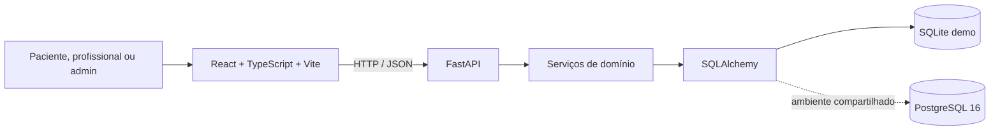

# Arquitetura do MedSync

## Visão geral

O MedSync é uma aplicação web dividida em uma SPA React/TypeScript e uma API
REST FastAPI. A API concentra regras de negócio e persistência; o navegador não
acessa o banco de dados diretamente.



## Estrutura do repositório

```text
MedSync/
├── backend/               API, regras de negócio e testes Python
├── frontend/              aplicação React e testes da interface
├── docs/                  decisões, arquitetura e roadmap
├── .env.example           configuração de referência
├── docker-compose.yml     PostgreSQL opcional
└── Makefile               atalhos de desenvolvimento
```

## Componentes

### Frontend

- React e TypeScript, empacotados pelo Vite.
- Rotas e navegação adequadas ao perfil ativo.
- Cliente HTTP para a API, configurado por `VITE_API_URL`.
- Componentes de formulário, feedback e agenda responsiva.
- Nenhuma regra crítica de autorização ou conflito existe apenas no cliente.

### Backend

- FastAPI para endpoints, validação de entrada e documentação OpenAPI.
- SQLAlchemy como camada de persistência.
- Serviços de domínio para geração de slots e ciclo do agendamento.
- Configuração por variáveis de ambiente.
- Seed de usuários e dados totalmente fictícios para demonstração.

### Persistência

- **SQLite:** padrão local para iniciar o protótipo sem serviço adicional.
- **PostgreSQL 16:** recomendado para trabalho compartilhado, validação de
  concorrência e evolução do sistema.

`DATABASE_URL` escolhe o banco. O Compose fornece somente PostgreSQL; frontend
e backend permanecem executados localmente enquanto não houver Dockerfiles
próprios.

## Domínio

O modelo conceitual mínimo é formado por:

- **Usuário:** identidade e perfil de acesso.
- **Paciente:** informações administrativas do paciente.
- **Profissional:** informações administrativas e vínculo com uma especialidade
  no protótipo atual.
- **Especialidade:** catálogo usado na pesquisa.
- **Disponibilidade:** períodos em que o profissional atende.
- **Consulta:** vínculo entre paciente, profissional, especialidade e intervalo
  de horário, acompanhado de status.

Evoluções de P1 podem acrescentar preferência, evento do agendamento, entrada
na fila de espera e notificação sem introduzir dados clínicos.

## Fluxo de agendamento

1. O frontend consulta especialidades e profissionais.
2. A API calcula slots a partir da disponibilidade.
3. A API remove períodos passados ou já ocupados.
4. Os horários são ordenados por proximidade e preferência de período.
5. O paciente envia o slot escolhido.
6. A API revalida autorização, disponibilidade e sobreposição.
7. A consulta é persistida em uma transação.
8. A resposta atualiza as visões do paciente e do profissional.

A lista exibida no navegador nunca é tratada como reserva. A verificação final
acontece na API para cobrir o intervalo entre visualizar e confirmar.

## Invariantes de agenda

- `starts_at` deve ser anterior a `ends_at`.
- Uma consulta ativa deve caber integralmente na disponibilidade.
- Um profissional não pode ter consultas ativas sobrepostas.
- Um paciente não pode ter consultas ativas sobrepostas.
- Cancelamento preserva o registro e libera seu intervalo.
- Remarcação valida o novo intervalo antes de liberar definitivamente o antigo.
- Datas e horas trafegam em ISO 8601; o domínio do demo usa
  `America/Sao_Paulo`.

O SQLite é suficiente para o comportamento demonstrativo. Em PostgreSQL, a
evolução deve combinar transação com uma constraint de exclusão por intervalo
para garantir a regra também sob requisições simultâneas.

## Autorização e privacidade

- Endpoints protegidos validam a identidade no backend.
- Paciente opera somente sobre seus agendamentos.
- Profissional opera somente sobre sua agenda e disponibilidade.
- Administrador mantém cadastros, sem acesso a conteúdo clínico inexistente no
  sistema.
- Senhas devem usar hash seguro e segredos não entram no Git.
- Logs não devem registrar senhas, tokens ou dados pessoais desnecessários.

Este é um protótipo acadêmico. Antes de uso real são necessárias revisão de
LGPD, modelagem de ameaças, política de retenção, auditoria, recuperação de
conta e testes de segurança.

## Estratégia de testes

- **Backend:** testes unitários das regras temporais e testes de integração dos
  endpoints e permissões.
- **Frontend:** lint e validação de build; uma suíte de componentes/fluxos é uma
  evolução prevista.
- **E2E:** fluxo principal com os usuários do seed.
- **PostgreSQL:** testes específicos de concorrência e restrições antes de um
  ambiente compartilhado.

Os comandos disponíveis estão no README. A existência desses comandos não
significa, por si só, que toda a suíte tenha sido executada ou aprovada.

## Limitações conhecidas do protótipo

- Banco SQLite por padrão.
- Dados e credenciais exclusivamente fictícios.
- Agenda em um único fuso e com duração fixa.
- Sem integração externa de mensagens.
- Sem múltiplas clínicas ou verificação oficial de profissionais.
- Sem prontuário, diagnóstico, triagem ou decisão clínica.
